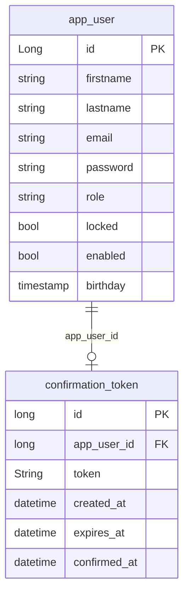

# Basic design requirements

- User login
- Interface to interact with the blockchain

# ERD



# Endpoints

## Login

### POST /api/v1/login

_Request_

```json
{
  "username" : string,
  "password": hash
}
```

_Response_

```json
{
  "status": HTTP_STATUS,
  "token": JWT
}
```

_Headers_

```
Authorization: bearer ...
```
